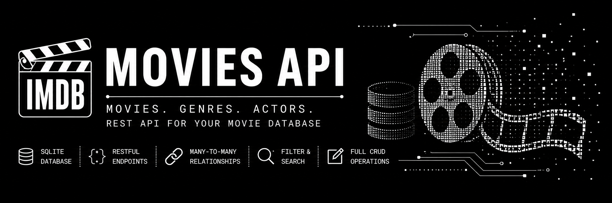

# movies-api

A high performance, relational REST API built in Go for managing structured movie metadata. Designed with a strict layered architecture, this API provides a strong foundation for applications requiring complex data relationships, dynamic querying, and strict data integrity.

## Architecture & Design

This project implements a clean, layered architecture to ensure separation of concerns, maintainability, and testability:

- **Handler Layer:** Manages HTTP request parsing, routing, and JSON serialization.
- **Service Layer:** Encapsulates business logic, data validation, and transactional orchestration.
- **Repository Layer:** Interfaces directly with the SQLite database, executing raw SQL queries and managing complex `JOIN` operations.

## Core Capabilities

- **Relational Data Management:** Full CRUD support for Movies, Actors, and Genres.
- **Complex Associations:** Handles Many-to-Many relationships (Movies ↔ Genres, Movies ↔ Actors) via junction tables.
- **Dynamic Querying:**
  - Case-insensitive partial text search (`/search?title=matrix`)
- **Strict Data Integrity:** Enforces `ON DELETE RESTRICT` foreign key constraints at the database level to prevent orphaned records.
- **Transactional Operations:** Implements database transactions (`BEGIN`, `COMMIT`, `ROLLBACK`) for multi-table inserts and safe `?force=true` cascading deletions.

## Tech Stack

- **Language:** Go (1.22+)
- **Database:** SQLite3 (`github.com/mattn/go-sqlite3`)
- **Routing:** Go Standard Library (`net/http` )

## Setup and Installation

### Local Development

Ensure Go 1.22+ and a C compiler (required for `go-sqlite3` CGO bindings) are installed.

1. Clone the repository:
   ```bash
   git clone https://gitea.kood.tech/muhammadowaisjaved/movies-api.git
   cd movies-api
   ```
2. Download dependencies:

   ```bash
   go mod tidy
   ```

3. Database Setup and migration:

   install the Goose CLI from the system terminal instead of VSCode/Zed terminal:

   ```bash
   go install github.com/pressly/goose/v3/cmd/goose@latest
   ```

    Ensure your Go binary path is included in your shell environment (PATH):

    ```bash
    # For Zsh (macOS default / Linux)
    echo 'export PATH=$PATH:$(go env GOPATH)/bin' >> ~/.zshrc && source ~/.zshrc


    # For Bash
    echo 'export PATH=$PATH:$(go env GOPATH)/bin' >> ~/.bashrc && source ~/.bashrc
   ```

   Verify the installation:

   ```bash
   goose -version
   ```

   Create the database and run migrations:

   ```bash
   goose -dir migrations sqlite3 ./internal/database/movies.db up
   ```

4. Run the application:

   ```bash
   go run ./cmd/api/main.go
   ```

## Containerization

The application includes a multi-stage Dockerfile and docker-compose.yml for consistent deployment across environments.

    docker-compose up --build

The API will be exposed on http://localhost:8080. The SQLite database file is persisted via a Docker volume in the ./data directory.

## Testing

The project includes a comprehensive automated testing suite. Tests are executed against isolated, in-memory SQLite databases (:memory:) to ensure no impact on the local development environment.

To run the unit tests:

    go test ./... -v

The project also includes Postman collection for basic CRUD apis. You can import the collection file to postman application and test apis and their response status.

## Team

| Syed Najam Ul Hassan Kazmi | [GitHub](https://github.com/Najam-Hassan-Kazmi) | [LinkedIn](https://www.linkedin.com/in/najam-ul-hassan-indie-web-developer/) | <br>
| Asha Gaire | [GitHub](https://github.com/ashagaire) | [LinkedIn](https://www.linkedin.com/in/asha-gaire-2b532217b/) |<br>
| Muhammad Owais Javed | [GitHub](https://github.com/muhammad-owais-javed/) | [LinkedIn](https://www.linkedin.com/in/muhammad-owais-javed/) |

## API Reference

### Movies

| Method   | Endpoint             | Description                                                                  |
| :------- | :------------------- | :--------------------------------------------------------------------------- |
| `POST`   | `/api/movies`        | Create a movie and establish actor/genre relationships                       |
| `GET`    | `/api/movies`        | Retrieve movies (Supports `size`, `year`, `genre` query params)      |
| `GET`    | `/api/movies/search` | Search movies by title (`?title=`)                                           |
| `GET`    | `/api/movies/{id}`   | Retrieve a specific movie                                                    |
| `PATCH`  | `/api/movies/{id}`   | Partially update movie attributes or relationships                           |
| `DELETE` | `/api/movies/{id}`   | Delete a movie (Fails if relationships exist unless `?force=true` is passed) |

### Genres & Actors

| Method   | Endpoint                                 | Description                               |
| :------- | :--------------------------------------- | :---------------------------------------- |
| `POST`   | `/api/genres` or `/api/actors`           | Create a new entity                       |
| `GET`    | `/api/genres` or `/api/actors`           | Retrieve all entities                     |
| `GET`    | `/api/genres/{id}` or `/api/actors/{id}` | Retrieve a specific entity                |
| `PATCH`  | `/api/genres/{id}` or `/api/actors/{id}` | Partially update an entity                |
| `DELETE` | `/api/genres/{id}` or `/api/actors/{id}` | Delete an entity (Supports `?force=true`) |

## Project Structure

```text

open-movies-db/
├── cmd/
│   └── api/
│       └── main.go           # Entry point: wires up dependencies and starts the server
├── internal/
│   ├── models/               # Struct definitions (Movie, Actor, Genre)
│   ├── database/             # SQLite connection setup (db.go)
│   ├── repository/           # Raw SQL queries (genre.go, movie.go, actor.go)
│   ├── service/              # Logic & validation (genre.go, movie.go, actor.go)
│   └── handler/              # HTTP routing, JSON encoding/decoding (genre.go, movie.go, actor.go)
├── migrations/               # Database Migration files
│   ├── 20260820220000_initial_schema.sql     # Schema for movieapi database table
│   └── 20260820230000_seed_data.sql          # Seeding the movie database with sample data
├── postman/
│   └── Movie Database API.postman_collection.json   # basic CRUD api collection from Postman application
├── Dockerfile
├── docker-compose.yml
├── go.mod
├── go.sum
└── README.md

```